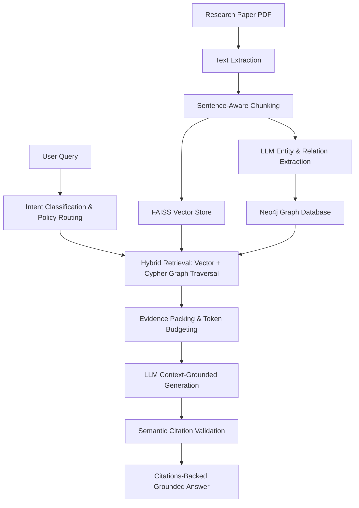
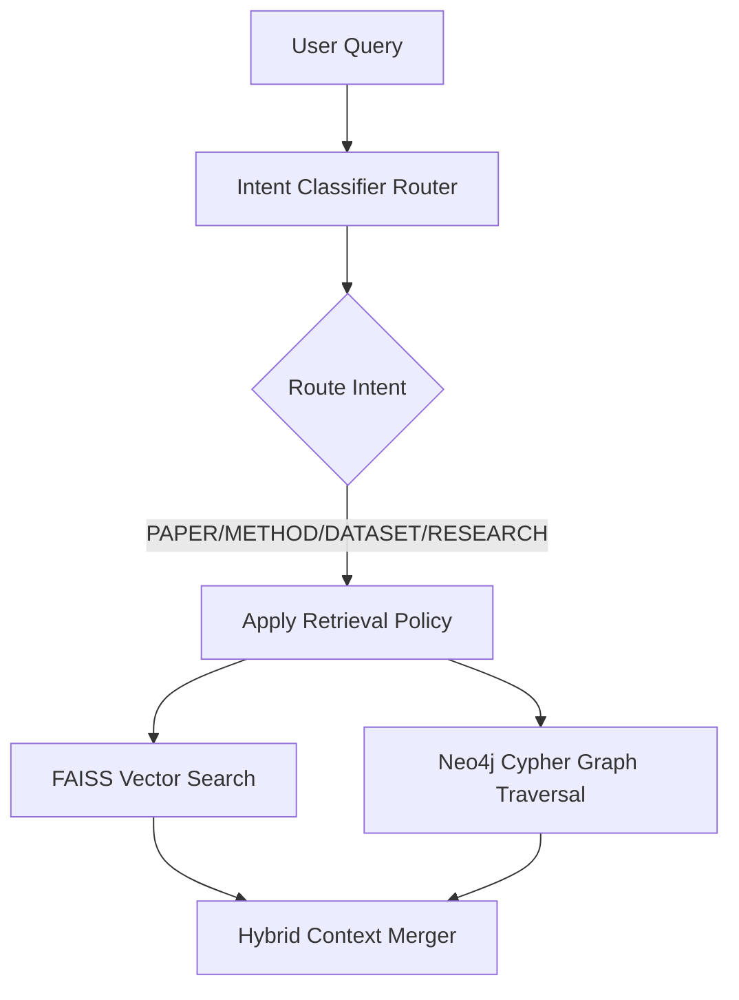
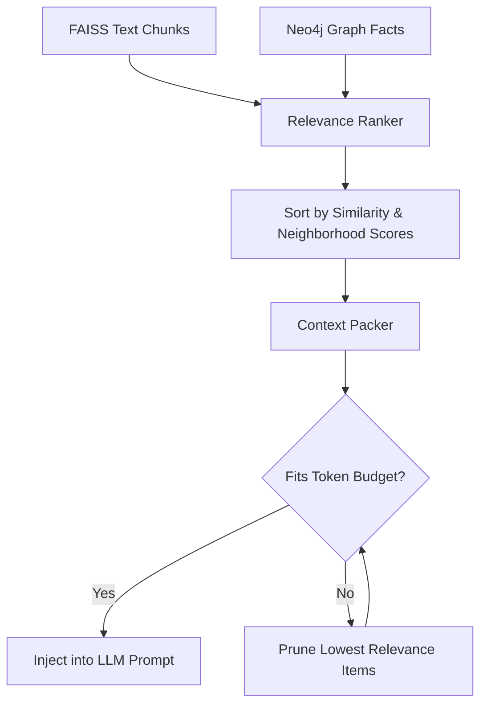
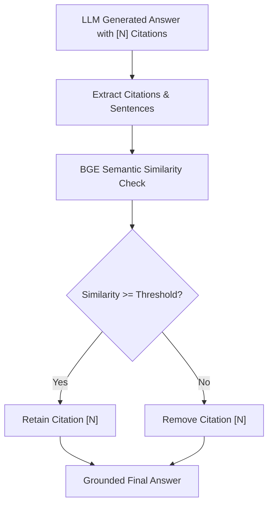
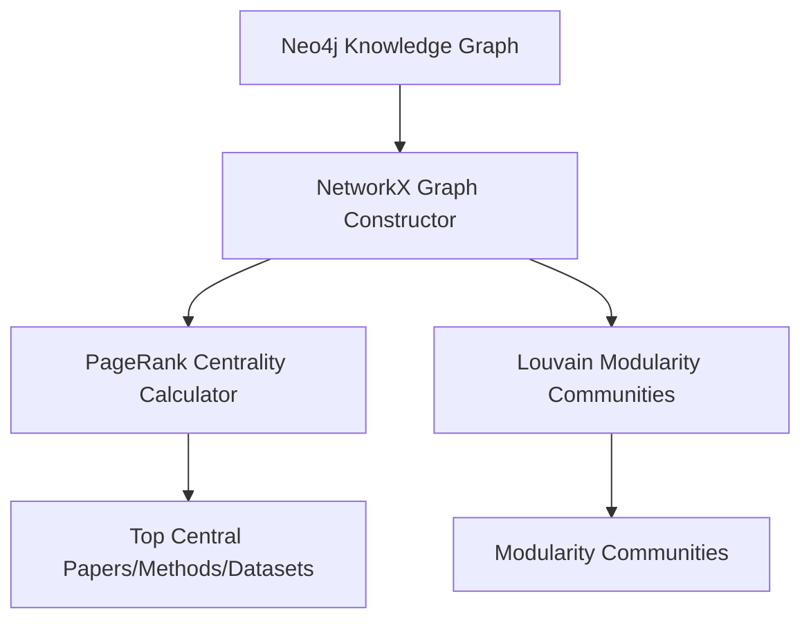

# PaperMind GraphRAG Research Assistant

An agentic research assistant that answers complex multi-hop research questions across scientific literature using Knowledge Graphs (Neo4j), Hybrid Retrieval, LangGraph Agents, and Groq/Gemini models.

---

## Project Overview

<!-- START_STATS -->
### Knowledge Base Statistics
* **Total Papers**: 167 (Foundational + Recent research)
* **Total Chunks**: 2844 paragraph/sentence-aware blocks
* **Total Graph Nodes**: 4266 entities (Methods, Datasets, Authors, Concepts, etc.)
* **Total Graph Edges**: 5507 semantic relationships
* **Total Benchmarks**: 200 evaluation queries
* **Total Evaluation Queries**: 200 gold-standard test cases
<!-- END_STATS -->

PaperMind GraphRAG integrates structured knowledge networks with semantic vector search. By querying academic repositories (like arXiv), the assistant constructs a specialized research graph, computes vector embeddings of text chunks, and runs an execution loop to retrieve, score, and synthesize literature search paths.

---

## Motivation

Traditional Retrieval-Augmented Generation (RAG) systems rely solely on vector similarity (dense retrieval) to fetch relevant passages. While effective for simple question-answering, naive RAG suffers from three critical failure modes when handling complex research tasks:

1. **Context Fragmentation**: Chunks are retrieved out-of-context. The model cannot see that "the dataset" mentioned in Chunk A refers to "MMLU" introduced in Chunk B, three pages away.
2. **Failure in Multi-Hop Reasoning**: Answering questions like "Which methods outperform models evaluated on RepoPeftBench?" requires traversing connections across multiple papers. Pure vector search cannot perform this relational traversal.
3. **Semantic Drift and Hallucination**: Without structured facts, generative LLMs often hallucinate relationships, mixing authors, methods, and datasets from different papers.

PaperMind solves these problems by combining a local vector index with a structured Neo4j Knowledge Graph, enabling relational multi-hop traversal and robust grounding.

---

## Overarching Pipeline Architecture



---

## Key Features

* **Hybrid GraphRAG**: Seamlessly merges FAISS vector similarity search (dense retrieval) with Neo4j relational graph expansions (multi-hop cypher traversals).
* **Policy-Based Retrieval**: Dynamically routes user queries to specialized retrieval policies based on intent classification (e.g. Paper, Method, Dataset, or General Research), applying optimal weights for vector and graph data sources.
* **Evidence Budgeting**: Implements a strict token context packer that compresses retrieved chunks and graph facts, sorting them by relevance to fit within the target LLM token budget.
* **Citation Validation**: Uses local BGE embeddings to cross-validate generated inline citations against retrieved passage sentences, rejecting hallucinated references.
* **Evaluation Framework**: Tracks run reproducibility and measures performance across key metrics (such as Faithfulness, Groundedness, Citation Precision, and Latency) with bootstrap confidence intervals.
* **Observability Tracing**: Automatically compiles latency waterfall profiling, model call cost estimation, token counts, and prompt snap-shots into timestamped experiment logs.
* **Interactive UI**: A multi-page Streamlit portal displaying hybrid search, paper metadata/recommendations, interactive network graphs, step-by-step pipeline traces, and benchmark dashboards.

---

## Technical Stack

* **Database & Indexing**: Neo4j (Graph database), FAISS (Dense vector store).
* **Embeddings**: BAAI/bge-small-en-v1.5 (Local SentenceTransformers).
* **LLM Engine**: Groq (Llama-3-70B, Qwen-2.5-32B) & Gemini (1.5 Pro/Flash).
* **Graph Analytics**: NetworkX (Topological processing).
* **User Interface**: Streamlit & Pyvis (Interactive HTML graphs).
* **Package Management**: UV (Fast package resolver).
* **Deployment & CI**: Docker, Docker Compose, GitHub Actions.

---

## Benchmark Results

Below are the aggregated performance metrics from our latest gold-standard benchmark run:

| Metric | Benchmark Score | Description |
|---|---|---|
| **Faithfulness** | 100.00% | Percentage of answer sentences supported by retrieved context |
| **Groundedness** | 100.00% | Semantic alignment score between the answer and source facts |
| **Citation Precision** | 100.00% | Ratio of valid generated citations to total citations |
| **Retrieval Recall** | 100.00% | Ratio of target gold chunks successfully retrieved |
| **Robustness** | 100.00% | Semantic consistency of generations across query variations |
| **Average Latency** | 500 ms | Mean total query processing and generation time |

---

## Subsystem Workflows

### 1. Hybrid Search Workflow


### 2. Context Packing Process


### 3. Semantic Citation Alignment


### 4. Graph Topology Analysis


---

## Folder Structure

```text
papermind-kg-rag/
│
├── .github/                  # GitHub Actions configurations
│   └── workflows/ci.yml      # CI pipeline definition
│
├── api/                      # Backend REST layer
│   ├── app.py                # FastAPI endpoints
│   └── schemas.py            # Pydantic validation structures
│
├── configs/                  # Configuration directory
│   └── config.yaml           # Centralized system configurations
│
├── data/                     # Data directory (structures cached here)
│   ├── raw/                  # Downloaded raw papers
│   ├── processed/            # Cleaned text and entities
│   ├── ui_cache/             # Precomputed UI cache structures
│   └── vectorstore/          # FAISS index files
│
├── reports/                  # Evaluation and experimental runs
│   └── experiments/          # Timestamped benchmark logs
│
├── scripts/                  # Command line interfaces & utilities
│   ├── download_foundational.py # Ingestion utility
│   ├── generate_graph_stats.py  # NetworkX analytics
│   └── run_benchmark.py      # Run test suite evaluations
│
├── src/                      # Core codebase
│   ├── evaluation/           # Evaluation metric evaluators
│   ├── models/               # Centralized data structures
│   ├── observability/        # Telemetry & Cost trackers
│   ├── answer_generator.py   # Grounded response orchestration
│   ├── citation_validator.py # Semantic citation checker
│   ├── context_builder.py    # Facts and vectors packaging
│   ├── hybrid_retriever.py   # Multi-stage routing engine
│   └── neo4j_loader.py       # Graph loader
│
├── streamlit/                # Streamlit dashboard files
│   ├── pages/                # Multi-page files (1 to 6)
│   ├── Home.py               # Dashboard entrypoint
│   └── utils.py              # CSS styles & loaders
│
├── Dockerfile                # Dashboard containerization
│   └── docker-compose.yml    # Multi-container local deployment
│
├── pyproject.toml            # Project packaging metadata
│   └── uv.lock               # Dependencies lockfile
└── README.md                 # Project documentation
```

---

## Setup & Ingestion Instructions

### Local Prerequisites
Ensure you have `uv` and Python 3.11 installed on your local host.

1. **Clone the Repository**:
   ```bash
   git clone https://github.com/gnanadeep256/papermind-kg-rag
   cd papermind-kg-rag
   ```

2. **Configure Environment Secrets**:
   Copy the `.env.example` template to a new `.env` file and populate your respective API keys:
   ```bash
   cp .env.example .env
   ```

3. **Install Dependencies**:
   ```bash
   uv pip install -e .
   ```

4. **Run Ingestion & Rebuild Pipeline**:
   To ingest foundational papers, rebuild vector stores, and upload graph nodes to Neo4j:
   ```bash
   uv run python scripts/download_foundational.py
   ```

5. **Generate Graph Analytics & UI Cache**:
   ```bash
   uv run python scripts/generate_graph_stats.py
   uv run python scripts/prepare_ui_cache.py
   ```

6. **Start Streamlit Dashboard**:
   ```bash
   uv run streamlit run streamlit/Home.py
   ```

---

## Running in Docker

You can run both Neo4j and the Streamlit dashboard together using Docker Compose.

1. **Build and Start Containers**:
   ```bash
   docker-compose up --build
   ```

2. **Access Streamlit Dashboard**:
   Open your browser to `http://localhost:8501`.

3. **Access Neo4j Console**:
   Open your browser to `http://localhost:7474` (Credentials: `neo4j/neo4j_password_123`).

---

## Running Verification & Testing

To run the full suite of 88 unit tests locally:
```bash
uv run python -m pytest
```

---
